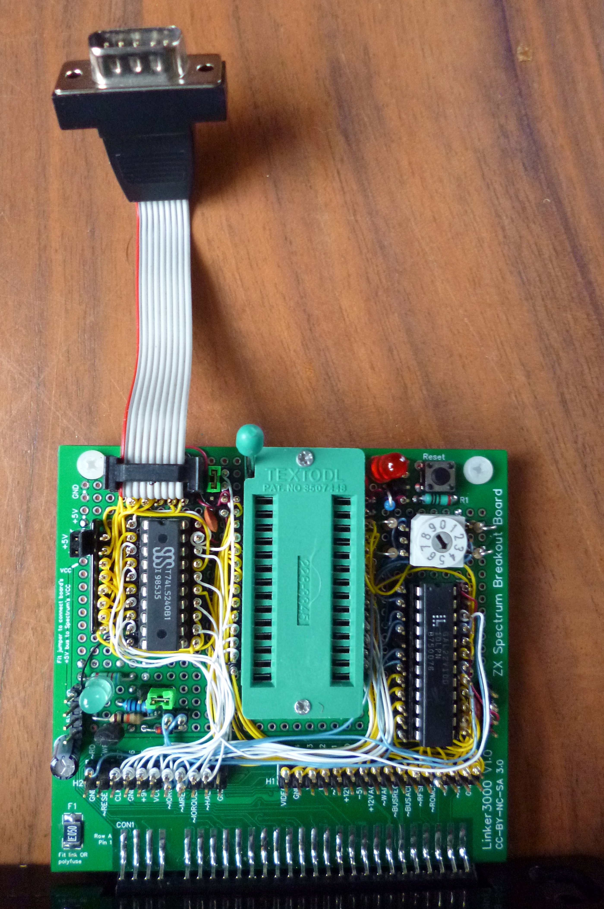

**This is a hobby project and comes with no official support. The PCB schematic and board design files are offered 'as is' with no claims made about their fitness for any specific purpose. Use at your own risk.**

# ZX-Spectrum-ROM-and-Joystick-Board

Based on the ZX Spectrum breakout board: https://github.com/linker3000/ZX-Spectrum-Breakout-Board

These are the design details for a ZX Spectrum expansion board that supports EPROM/ROM devices and also provides the control signals for two Kempston-compatible joystick interfaces. This is a self-build project and these notes are suitable for experienced electronics hobbyists and professional engineers who fancy a bit of DIY making.

This version of the board has been wire-wrapped as per the technique described here: https://github.com/linker3000/Z80-Board. Feel free to use point-to-point wiring if you prefer!

## Features

* The design supports 27x64 (8K), 27x128 (16K) and 27x256 (32K) EPROMS and their EEPROM equivalents (eg: 28C64). The board logic supports static linear ROM mapping - no clever banking or dynamic swapping. The wiring could be adapted to support parallel flash - go for it!

* A rotary BCD DIP switch selects EPROM functionality:

  * 0 = 8K in 2764                                                    
  * 1 = 16K in 27128                                                  
  * 2 = 8K in 1st half of 27128                                       
  * 3 = 8K in 2nd half of 27128                                       
  * 4 = 16K in 1st half of 27256                                               
  * 5 = 16K in 2nd half of 27256                                               
  * 6 = 8K in 1st quarter of 27256                                            
  * 7 = 8K in 2nd quarter of 27256                                            
  * 8 = 8K in 3rd quarter of 27256                                            
  * 9 = 8K in 4th quarter of 27256   
  
  NB: Power down the Spectrum and board before inserting or changing chips, and weird things will happen if the switch is changed when everything is powered up! If you do need to change the switch 'mid flow', hit the reset button (if fitted!) to continue.
  
* There's a ROM enable/disable jumper

The main control logic is based on a 22V10 GAL. This is a device that needs programming. I used the low-cost TL866II 'universal programmer' (IMPORTANT: Untick 'Encrypt Ch' otherwise the GAL may not program correctly). The .jed file is ready to upload to the programmer. If you want to edit/change the source .pld file, you will need a copy of WinCUPL (free from https://www.microchip.com/design-centers/programmable-logic/spld-cpld/tools/software/wincupl) or another CUPL editor.

## Tested ROMS

This board should work with any standard 8K or 16K ROM, but for the sake of testing the following have been tried either as the single image in an EPROM, or in the upper/lower half of a larger EPROM. The slowest EPROM to hand was a 32K 250nS (-25) part and that worked fine. 8K images have also been tested in a 28C64 8K EEPROM. 

* Dr Ian Logan's diagnostics ROM (8K): http://www.fruitcake.plus.com/Sinclair/Interface2/Cartridges/Files/ROM_Dumps/System_Test_ROM.bin
* Phil Ruston's diagnostics ROM V1.5 (16K): http://blog.retroleum.co.uk/electronics-articles/a-diagnostic-rom-image-for-the-zx-spectrum/
* Brendan Alford's diagnostics ROM (16K): https://github.com/brendanalford/zx-diagnostics/wiki/Firmware
* Geoff Wearmouth's Gosh Wonderful BASIC ROM: https://web.archive.org/web/20150602175320/http://www.wearmouth.demon.co.uk/
* Interface 2 ROM games (out there if you look)
  * Jet Pac (8K)
  * Psst (16K)
  * Planetoids (8K)
  * Space Raiders (8K)
  * Probably all the others (not tested)

## Schematic

 ## Design Notes
 
 * U3 and U4 and surrounding circuitry are for the joystick interfaces - omit if not needed. U3 and U4 can be 74LS240 OR 74LS640 buffers. J5 and J6 (or wire jumpers) select which chip type is fitted.
 * The polyfuse (F1) is for overcurrent/fault protection for the ZX Spectrum. Replace with a wire link if deemed not necessary.
 * The prototype board used 10K resistors instead of 8K2.
 * D1: Some other online ROM board schematics show this diode (incorrectly) in the emitter leg of the transistor circuit.
 * See also: https://github.com/linker3000/ZX-Spectrum-Breakout-Board                                 
 
## Bill of materials
 
General notes on the components used for the prototype 

ID	Part | Description 
----------|----------
C1|100uF 10V or 16V radial electrolytic capacitor. 
C2-C5|Capacitor 0.1uF 50V ceramic.
F1|500mA polyfuse SMD 1812 eg: Bourns MF-MSMF050-2 OR through hole eg: Tayda A-2441 - https://www.taydaelectronics.com/circuit-protection/polyswitch-devices/poly-switch-resettable-rxef-series-jk-30v-0-50a.html. 
Jx|0.1” (2.54mm) header pins with 2-pin jumpers. J2 enables/disables the onboard EPROM while also doing the opposite for the ZX Spectrum's internal ROM. 
Q1|2N3906 or any general purpose PNP transistor.
R1|The schematic shows this as 1K but it should be 100R
8K2 resistors|The prototype used 10K resistors. 
Resistors|All resistors are 1/4W (0.25W). Tolerance is not important (1%, 2% or 5%) 
D1|Any small signal silicon diode (eg: 1N4148). 
SW2|BCD rotary switch. eg: APEM PT65-101 or equivalent. 4 x 2-pin jumpers or regular DIP switches could be used.
U1|GAL22V10 programmed with the .jed code provided here. WinCupl source code is in the .pld file. The original GAL22V10 chip manufactured, mainly, by Lattice is no longer in production although they can be purchased as 'refurbished stock' or 'new old stock' from various sources on auction sites, but check supplier recommendations as there are a lot of re-marks and fakes out there, plus the chips can only be programmed a nominal 100 times so they can wear out and become unusable. One reasonably reliable direct supplier is UT Source (https://www.utsource.net/), although check shipping charges.  Fortunately, Atmel (Microchip) still makes a functional equivalent called the ATF22V10 and these are widely available from mainstream electronic component suppliers. Note that although the ATF22V10 is outwardly functional to a GAL22V10, the programming algorithm is completely different and so your programmer must support them specifically. As of July 2020, the TL866II (and likely the older TL866A/CS programmers) running the latest firmware will program GAL22V10 and ATF22V10 chips. Both chip types have been tested successfully on this board.
U2|28-pin IC socket - use a quality turned pin one or (preferably) a ZIF socket.
U3, U4|74LS240 OR 74LS640 buffers. See design notes above.
