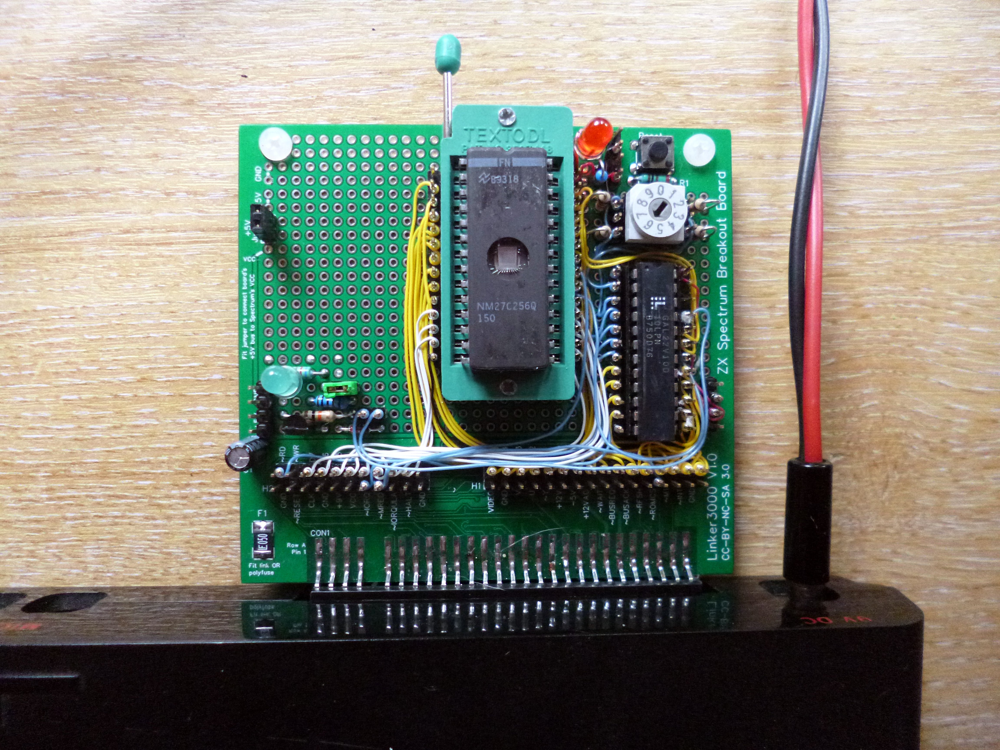
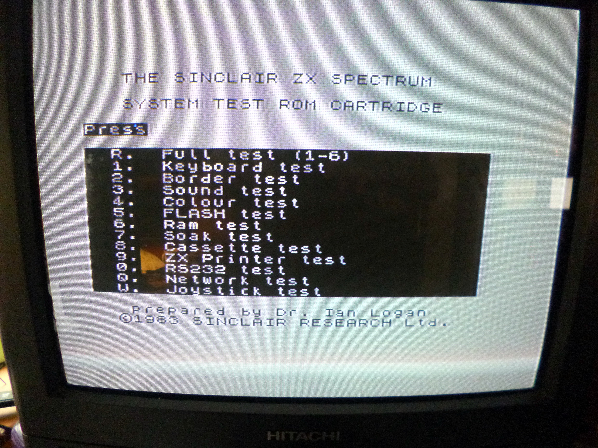
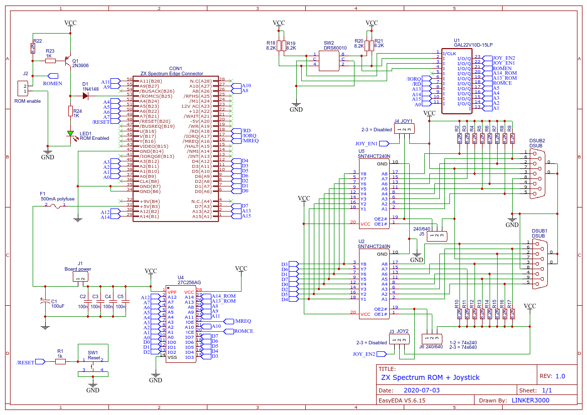

**This is a hobby project and comes with no official support. The PCB schematic and board design files are offered 'as is' with no claims made about their fitness for any specific purpose. Use at your own risk.**

# ZX-Spectrum-ROM-and-Joystick-Board

Based on the ZX Spectrum breakout board: https://github.com/linker3000/ZX-Spectrum-Breakout-Board

These are the design details for a ZX Spectrum expansion board that supports EPROM/ROM devices and also provides the control signals for two Kempston-compatible joystick interfaces. This is a self-build project and these notes are suitable for experienced electronics hobbyists and professional engineers who fancy a bit of DIY making.

This version of the board has been wire-wrapped. Feel free to use point-to-point wiring if you prefer!

## Features

* The design supports 27x64 (8K), 27x128 (16K) and 27x256 (32K) EPROMS and their EEPROM equivalents (eg: 28C64). The board logic supports static linear ROM mapping - no clever banking or dynamic swapping. The wiring could be adapted to support parallel flash - go for it!

* A rotary BCD DIP switch selects EPROM functionality:

  * 0 = 8K in 2764                                                    
  * 1 = 16K in 27128                                                  
  * 2 = 8K in 1st half of 27128                                       
  * 3 = 8K in 2nd half of 27128                                       
  * 4 = 16K in 1st half of 27256                                               
  * 5 = 16K in 2nd half of 27256                                               
  * 6 = 8K in 1st quarter of 27256                                            
  * 7 = 8K in 2nd quarter of 27256                                            
  * 8 = 8K in 3rd quarter of 27256                                            
  * 9 = 8K in 4th quarter of 27256   

* There's a ROM enable/disable jumper

The main control logic is based on a 22V10 GAL. This is a device that needs programming. I used the low-cost TL866II 'universal programmer' (IMPORTANT: Untick 'Encrypt Ch' otherwise the GAL may not program correctly). The .jed file is ready to upload to the programmer. If you want to edit/change the source .pld file, you will need a copy of WinCUPL (free from https://www.microchip.com/design-centers/programmable-logic/spld-cpld/tools/software/wincupl) or another CUPL editor.

## Tested ROMS

* Dr Ian Logan's diagnostics ROM (8K): http://www.fruitcake.plus.com/Sinclair/Interface2/Cartridges/Files/ROM_Dumps/System_Test_ROM.bin
* Phil Ruston's excellent diagnostics ROM V1.5 (16K): http://blog.retroleum.co.uk/electronics-articles/a-diagnostic-rom-image-for-the-zx-spectrum/
* Brendan Alford's diagnostics ROM (16K): https://github.com/brendanalford/zx-diagnostics/wiki/Firmware

## Schematic

 ## Design Notes
 
 * U3 and U4 and surrounding circuitry are for the joystick interfaces - omit if not needed. The prototype board pictured does not yet have this circuitry. U3 and U4 can be 74LS240 OR 74LS640 buffers. J5 and J6 (or wire jumpers) select which chip type is fitted.
 * The polyfuse (F1) is for overcurrent/fault protection for the ZX Spectrum. Replace with a wire link if deemed not necessary.
 * The prototype board used 10K resistors instead of 8K2.
 * D1: Some other online ROM board schematics show this diode (incorrectly) in the emitter leg of the transistor circuit.
 * See also: https://github.com/linker3000/ZX-Spectrum-Breakout-Board                                 
 
## Bill of materials
 
General notes on the components used for the prototype 

ID	Part | Description 
----------|----------
C1|100uF 10V or 16V radial electrolytic capacitor. 
C2-C5|Capacitor 0.1uF 50V ceramic.
F1|500mA polyfuse SMD 1812 eg: Bourns MF-MSMF050-2 OR through hole eg: Tayda A-2441 - https://www.taydaelectronics.com/circuit-protection/polyswitch-devices/poly-switch-resettable-rxef-series-jk-30v-0-50a.html. 
Jx|0.1” (2.54mm) header pins with 2-pin jumpers. J2 enables/disables the onboard EPROM while also doing the opposite for the ZX Spectrum's internal ROM. 
Q1|2N3906 or any general purpose PNP transistor.
R1|The schematic shows this as 1K but it should be 100R
8K2 resistors|1% or 5% 1/4W carbon or metal film resistors. 
D1|Any small signal silicon diode (eg: 1N4148). 
SW2|BCD rotary switch. eg: APEM PT65-101 or equivalent. 4 x 2-pin jumpers or regular DIP switches could be used.
U1|GAL22V10 programmed with the .jed code provided here. WinCupl source code is in the .pld file.
U2|28-pin IC socket - use a quality turned pin one or (preferably) a ZIF socket.
U3, U4|74LS240 OR 74LS640 buffers. See design notes above.
